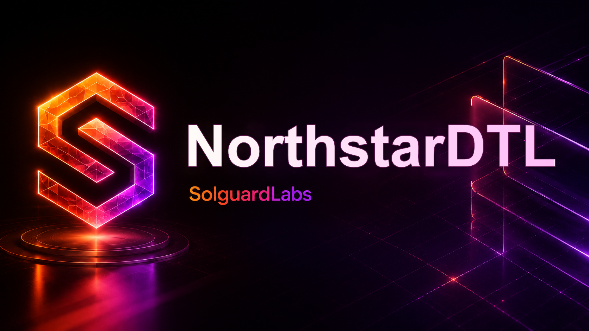

# NorthstarDTL



NorthstarDTL es un router Go de liquidez para liquidaciones cross-asset con
rutas preferentes, scoring por salud operativa, penalización por congestión y
ejecución asíncrona de tickets. El servicio modela un catálogo de rutas RFQ y
pools internos, reserva fondos durante admisión y liquida tickets cuando el
epoch operativo los marca como listos.

## Componentes

- `src/domain`: tipos económicos, tickets, cotizaciones, recibos y snapshots.
- `src/routing`: catálogo de rutas, scoring, ranking, fallback y planes.
- `src/ledger`: libro de balances, reservas y reconciliación por asset.
- `src/settlement`: cola asíncrona, ejecución y receipts.
- `src/api`: servicio embebido y handler HTTP.
- `src/scenario`: runner de fixtures JSON usado por los tests TypeScript.

## Requisitos

- Go 1.22 o superior.
- Node.js 24 o superior.
- npm para instalar dependencias de test.

## Comandos

```bash
npm install
go test ./...
npm test
npm run check
npm run loc
bash scripts/ci.sh
```

Ejecutar un escenario:

```bash
go run ./cmd/northstardtl run tests/fixtures/settlement.json
```

Levantar el servicio local:

```bash
go run ./cmd/northstardtl serve --addr 127.0.0.1:8091
```

Endpoints:

- `GET /snapshot`
- `POST /quote`
- `POST /submit`
- `POST /execute`
- `POST /route`

## Flujo Operativo

1. El cliente envía un intent con par de assets, importe, límites y prioridad.
2. El router calcula cotizaciones por ruta compatible.
3. La ruta con mejor score operativo admite el ticket y reserva el importe.
4. El ticket queda en cola hasta su epoch de ejecución.
5. El executor procesa tickets listos, registra recibos y actualiza balances.

## Tests

La suite pública valida:

- scoring de rutas preferentes y alternativas congestionadas;
- cambios de ranking por congestión;
- ejecución sobre fallback disponible;
- settlement contable y receipts.

## Estado

Repositorio de laboratorio con fixtures deterministas y CI reproducible. No
requiere servicios externos para compilar, testear ni ejecutar escenarios.
